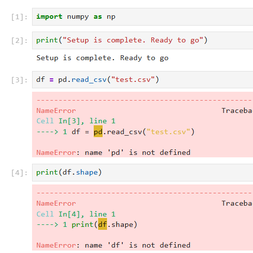
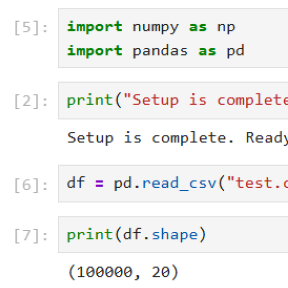
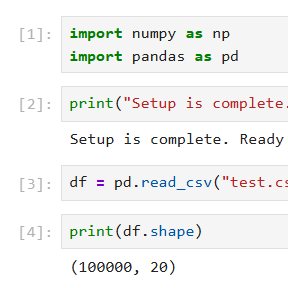

# Jupyter Execution Count Reset

This utility script rewrites the `execution_count` values in a Jupyter Notebook to ensure they are sequential and consistent. It is useful when notebooks have been run out of order due to trial-and-error, restarts, or selective cell execution.

## Example

| Error occurs | Debugging causes inconsistent cell numbers | Run script for consistent cell numbers |
|:---:|:---:|:---:|
|  |  |  |

## Usage

1. Download the script and place it in the same directory as the target notebook.
2. Run the script using one of the following methods:

    a. From the command line:
      ```console
      python rewrite_exe_count.py <insert-your-notebook-name>.ipynb
      ```
    
    b. From a Jupyter notebook cell:
      ```console
      !python rewrite_exe_count.py <insert-your-notebook-name>.ipynb
      ```
